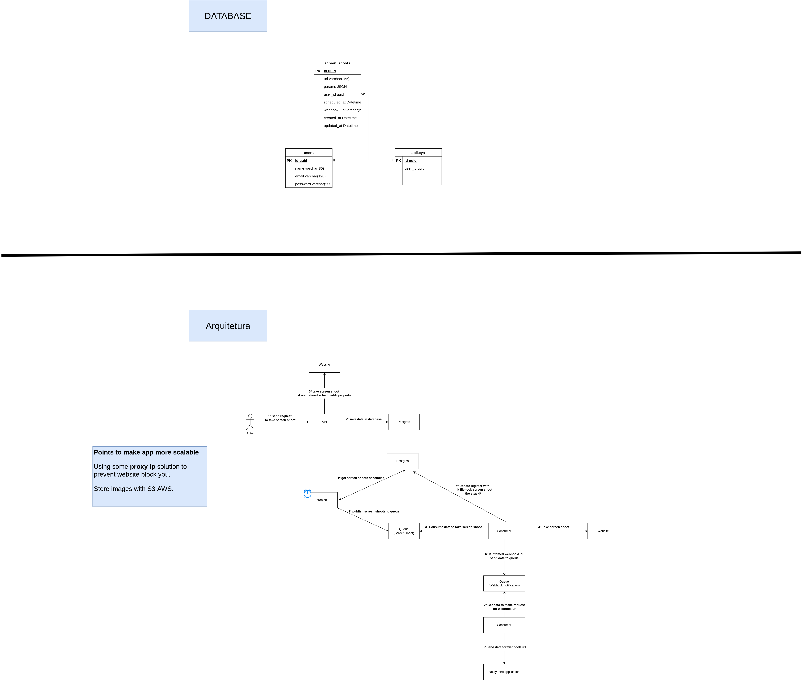

The project:
==============

- The project has focus improving my knownledge about Nest.js and your resources.

Technologies:
==============

- Node.js
- Typescript
- Nest.js
- Redis + Bull(QUEUE)
- Winston(Logs)
- New relic(Monitoring performance and errors unhandler)
- Docker + Docker compose

Instructions to running project: 
==================================

- Clone repository
- Execute command **npm install** to install all modules the project needs
- Create directory **screenshoots_images** in root directory, becuase all screen shoots sotred within this directory
- Create directory **logs** in root directory to store file logs. The file **application-errors.log** store erros in application and file **application.log** store all actions and interaction the application.
- Create **.env** file based **.env.example**
- Execute command **docker-compose up -d** to running all containers the application needs in background
- Execute command **npm run start:dev** to running application in dev environment.
- Execute commands **npm run build && npm run start:prod** to running application in production environment
- Execute command **npm run build && npm run consumer:prod** to running consumer the queue. WARNING: in **.env** file set env **DISABLE_SCHEDULE_TASKS** equal **true** to prevent schedule task process something in consumers process and prevent consumer duplicate information.

Architecture and Database:
===========================

